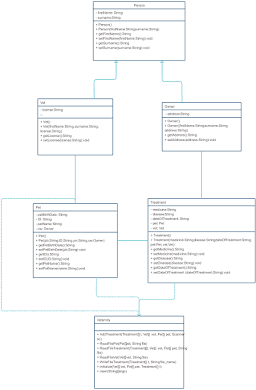
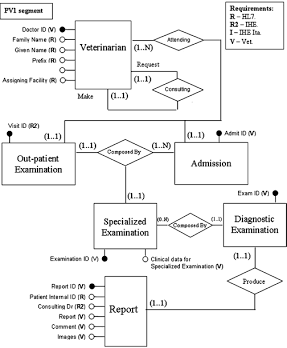

# VetCare - Veterinary Management System

## Description
VetCare is a comprehensive desktop application designed to streamline and automate clinical and administrative workflows for veterinary clinics. Built using Java 8+ following clean software design principles, the application manages multi-entity operations—including pet owner records, medical appointments, veterinarian schedules, inventory tracking, and role-based access control—with persistent storage provided by a PostgreSQL database via JDBC.

## Use Case
Veterinary practices often face operational bottlenecks when managing patient histories, preventing double-booked appointments, tracking low-stock medications, and controlling access levels for staff. VetCare solves these problems through a centralized architecture that enforces strict domain validation rules (e.g., prohibiting overlapping veterinarian schedules or duplicate pet registrations for the same owner) and provides clear data separation across application layers.

## Technologies
- **Programming Language:** Java 8+ 
- **Database:** PostgreSQL 15+
- **Containerization:** Docker & Docker Compose
- **Persistence Layer:** Raw JDBC (Java Database Connectivity) with `PreparedStatement`
- **Database Tooling:** pgAdmin 4
- **Architecture & Design Patterns:** Layered Architecture, Repository Pattern (DAO), Dependency Injection, Data Transfer / Value Mapping
- **Development Environment:** NetBeans IDE / Apache Maven

## Package Structure
```text
com.mycompany.vetcare
│
├── conexiondb/         # JDBC Connection Management (Singleton Pattern)
│
├── model/              # Domain Models & Enumerations
│   ├── Appointment.java
│   ├── AppointmentStatus.java
│   ├── Medicine.java
│   ├── Owner.java
│   ├── Pet.java
│   ├── User.java
│   ├── UserRole.java
│   └── Vet.java
│
├── repository/         # Data Access Interfaces (Contracts)
│   ├── CitaRepository.java
│   ├── MedicineRepository.java
│   ├── OwnerRepository.java
│   ├── PetRepository.java
│   ├── UserRepository.java
│   ├── VetRepository.java
│   └── impl/           # Concrete JDBC Implementations
│       ├── CitaRepositoryImpl.java
│       ├── MedicineRepositoryImpl.java
│       ├── OwnerRepositoryImpl.java
│       ├── PetRepositoryImpl.java
│       ├── UserRepositoryImpl.java
│       └── VetRepositoryImpl.java
│
├── service/            # Business Logic & Validation Layer
│
└── ui/                 # Presentation Layer (Console / JOptionPane Interface)
```

## Class Diagram



## Entity-Relationship Diagram



## Database Configuration
1. Ensure Docker and Docker Compose are installed and running.
2. In the project root directory, run:
~~~bash
docker compose up -d
~~~
3. This command starts a PostgreSQL database container and automatically applies the initial DDL schema.

## Execution Instructions
1. Clone this repository:
~~~bash
git clone https://github.com/andresmbd/simulacro_java.git
~~~
2. Open the project in NetBeans IDE or your preferred Java IDE.
3. Run the database container as described in the Database Configuration section.
4. Locate Main.java and execute the class (Shift + F6 in NetBeans).

## Implemented Features
- Owner Management: Full CRUD operations, document uniqueness validation, and active/inactive status toggles.

- Pet Management: Pet profile creation linked to registered owners with business validation preventing duplicate registrations (same owner, pet name, and birth date).

- Veterinarian Management: Specialty filtering, professional license uniqueness validation, and active status tracking.

- Appointment Lifecycle: Scheduling and state transition tracking (PROGRAMADA, CONFIRMADA, EN_ATENCION, FINALIZADA, CANCELADA) with schedule conflict detection (preventing overlapping appointments for the same vet at the same date and time).

- Inventory Control: Stock tracking, direct stock adjustments, and low-inventory query reports (stock <= minStock).

- User Security & RBAC: Role-based access control (ADMINISTRADOR, VETERINARIO, RECEPCIONISTA) with secure authentication lookup.

## Coder Infomation
- Coder Name: Andrés

- Role: Web & Software Development Apprentice

- Program: Riwi - Software Development

- GitHub: https://github.com/andresmbd

- clan: Puerta De Oro